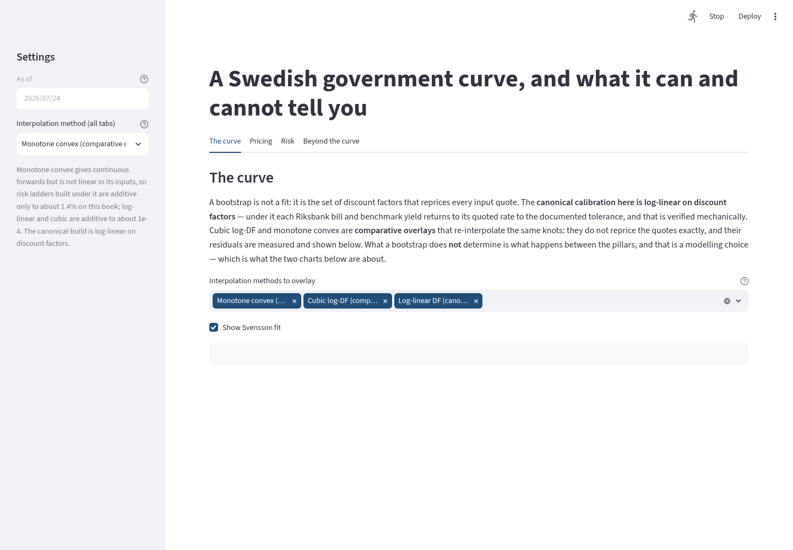

# yieldcurve

An educational fixed-income analytics project built around a frozen market-data snapshot. It demonstrates curve construction, selected instrument valuation, interest-rate risk diagnostics, and a one-factor Hull-White example. It is not a trading, accounting-valuation, regulatory-reporting, or production risk system.

## Quick start

Requires Python 3.12 and [`uv`](https://docs.astral.sh/uv/). One command installs the package, the test tooling, and the Streamlit app from the lockfile:

```bash
uv sync --frozen --extra dev --extra app
```

Nothing in this command (or any later step) touches the network at runtime: all market data ships inside the package as a read-only snapshot.

Run the package tests (the coverage-gated command):

```bash
uv run pytest --ignore=tests/app --ignore=tests/test_notebook_hygiene.py \
  --cov=yieldcurve --cov-report=term-missing --cov-fail-under=90
```

Run the app from the checkout:

```bash
uv run streamlit run app.py
```

A short library example — load the frozen snapshot, build the USD curve set, price a bill:

```python
from datetime import date
from yieldcurve.market.snapshot import Snapshot
from yieldcurve.curves.build import usd_curveset
from yieldcurve.instruments import Bill
from yieldcurve.curves.pricing import price

snapshot = Snapshot(date(2026, 7, 24))       # the committed, read-only snapshot
asof = date(2026, 7, 24)
curves = usd_curveset(snapshot, asof)        # OIS discount curve + 3M forecast curve
bill = Bill(maturity=date(2027, 7, 24))
result = price(bill, curves, asof=asof)

print(f"Bill clean price: {result.clean:.4f}")
print(f"Discount factor at 1Y: {curves.discount.df(1.0):.6f}")
```

Output:

```
Bill clean price: 95.9903
Discount factor at 1Y: 0.959903
```

## The app in about 60 seconds



1. **Launch.** `uv run streamlit run app.py` opens at `http://localhost:8501`. The sidebar pins the as-of date to the one committed snapshot (2026-07-24) and exposes a single global control: **Interpolation method (all tabs)** — log-linear DF is the canonical calibration; monotone convex and cubic log-DF are comparative overlays.
2. **The curve tab.** Zero-rate and 3-month forward charts show the calibration pillars as dotted lines. Below them, the **Quote-repricing residuals** table reports every input quote's target rate, each method's model rate, and the residual in basis points — the canonical log-linear build stays within the documented 1e-6 bp tolerance; the overlays leave measured residuals wherever a payment falls between knots. The **Svensson RMSE (bp)** metric shows the price of fitting six parameters to the whole curve.
3. **The Pricing tab.** Pick a Riksgälden government bond (SGB) from the **Bond** selector. Clean, accrued, and dirty prices (per 100 face), the street-convention yield to maturity, and a cashflow table whose PVs sum to the dirty price — the visible proof that the pricer only discounts.
4. **The Risk tab.** **One bond's risk** gives DV01 (the positive loss per 1 bp, in SEK per 100 face), modified and effective duration, and two convexities. **Two ladders that do not agree** contrasts key-rate duration with the par-rate delta ladder and states how additive each interpolation scheme is. **Illustrative ΔEVE comparison (EU 2024/856 shocks)** revalues a stylised single-currency SEK book under the six EU 2024/856 supervisory shocks — an educational exhibit, not an EVE measure or an IRRBB submission. **What rates actually did (historical proxy)** shows a linearized delta VaR/ES over the five-year US Treasury CMT history, explicitly labelled a proxy, not SEK VaR.
5. **The Beyond the curve tab.** Three sections — "A government curve is not a discount curve", "A curve has no dynamics", "A curve prices linear products only" — with the USD government-swap basis, PCA components, and a Hull-White illustration whose sliders drive the illustration only.

## Verified here / not implemented

| Verified here (measured) | Not implemented |
|---|---|
| Log-linear DF calibration reprices every input quote within the documented 1e-6 bp tolerance; the final per-quote residuals are measured and reported for every method (`repricing_report`). | Institution-wide IRRBB or net-interest-income measures. The app's ΔEVE chart is an illustrative, single-currency comparison on a stylised book. |
| Selected calculations cross-checked against QuantLib: bond clean, dirty, accrued and yield; modified duration and convexity via the price change; and one Hull-White swaption NPV via QuantLib's Jamshidian engine. | Behavioural deposit or prepayment models (no non-maturity accounts, no NII). |
| The ECB's published Svensson parameters reconstruct the ECB's published spot curve within 0.5 bp at every published tenor; the library's own Svensson fit lands within 1.0 bp at every tenor with RMSE below 0.5 bp. | FRTB, capital, AVA, accounting classification (e.g. IFRS level hierarchy), or supervisory reporting. |
| The six EU 2024/856 supervisory shocks of Article 1(1) — parallel up/down, short up/down, steepener, flattener — with the USD/SEK parameters (200/300/150 bp) and the Article 3(7) post-shock rate floor. | Trade capture, order execution, authentication, or access control. |
| DV01 is a positive loss per 1 bp in SEK per 100 face (the loss-tail convention is pinned by tests). | Licensed market-data redistribution: no third-party feed is shipped; FRED's retrieval terms and the unverified Riksgalden/Bloomberg statuses are recorded in `DATA_SOURCES.md`. |
| Package statement coverage is measured at 94.93% by the package-test command above (which enforces a 90% floor). | XVA or counterparty exposure. |
| The wheel carries all 11 packaged datasets, `scenarios.toml`, and the model-limitations doc; the sdist's denylist scan reports zero local-state hits (asserted by `tests/test_build.py`). | Live or streaming market data: one frozen, fully offline snapshot; there is no refresh tooling and no network path in the package. |
| A golden pipeline file pins end-to-end values as a regression check. | A validated production risk model. The checks in this README are software verification, not empirical or regulatory model validation. |

## What the repository demonstrates

- **Curve construction.** Sequential bootstrap of discount factors in maturity order, with a typed repricing report after the final curve. Log-linear DF interpolation is the canonical method (exact quote repricing, piecewise-constant forwards). Cubic log-DF and monotone-convex (Hagan-West, without the positivity amendment) are comparative overlays with measured residuals.
- **Instruments and pricing.** Bills, fixed-coupon bonds (accrual, clean/dirty), floating-rate notes, fixed-for-floating swaps, and OIS, all priced off a shared reference-date discount convention. Multi-curve sets separate the discount curve from the forecast curve.
- **Interest-rate risk.** Effective/modified duration, DV01 (positive-loss convention), dollar convexity, key-rate duration, a par-rate delta ladder, PCA on historical yield changes, EU 2024/856 scenario revaluation, and a linearized delta VaR/ES proxy.
- **One-factor Hull-White example.** Mean-reversion calibration to an illustrative swaption vol grid, Jamshidian swaption pricing, zero-coupon bond options, and Bachelier normal-vol support. See `docs/hull-white-limitations.md` for the model's bounded validity.
- **Parametric fits.** Nelson-Siegel and Svensson families fitted with explicit fit-result diagnostics (bounds, Jacobian, residuals).

## Market data: one frozen, offline snapshot

The repository ships exactly one read-only snapshot, dated 2026-07-24, as packaged resources. Its eleven datasets are each classified as **public** (observed values with a source and licence status), **constructed** (computed in this repository from recorded inputs), or **illustrative** (fabricated with a documented shape — the swaption vol grid is not market data and not a fit to any traded price). Every dataset records publisher, retrieval and observation dates, transformation, licence/redistribution status, and limitations in `DATA_SOURCES.md`, pinned by tests against the packaged bytes.

The snapshot is what makes the repository fully offline: no module touches the network, no download or update instructions exist, and the app's as-of date is pinned to it. The USD curve is a CMT-implied approximation built from US Treasury constant-maturity par yields plus a dated OIS spread and a Term-SOFR basis (both recorded as approximate, constructed inputs).

## Software verification (measured)

Everything below is a software verification check with an exact measured quantity — it establishes that this implementation behaves as its own contract states. It is not an empirical or regulatory validation of the models.

| Check | Measured quantity | Where |
|---|---|---|
| Package tests, coverage-gated | `682 passed, 1 skipped`; statement coverage `94.93%` against a 90% floor | `uv run pytest --ignore=tests/app --ignore=tests/test_notebook_hygiene.py --cov=yieldcurve --cov-report=term-missing --cov-fail-under=90` |
| App behavior and accessibility | `57 passed` | `uv run pytest -o addopts='' tests/app` |
| QuantLib cross-checks | clean/dirty price within 1e-8 per 100 face; accrued within 1e-10; yield within 1e-8 absolute; duration and convexity through the price change | `tests/test_quantlib_parity.py`, `tests/parity/test_quantlib_risk.py` |
| Hull-White swaption NPV vs QuantLib Jamshidian engine | `test_normal_vol_matches_an_independent_quantlib_price` | `tests/models/test_hullwhite_swaptions.py` |
| ECB Svensson reconstruction | published parameters rebuild the published spot curve within 0.5 bp at every published tenor; independent fit within 1.0 bp, RMSE < 0.5 bp | `tests/curves/test_parametric.py` |
| Log-linear quote repricing | every quote within the 1e-6 bp tolerance; overlay residuals measured per quote (off-knot residuals of order 1e-5 in decimal rate) | `tests/curves/test_bootstrap.py` |
| EU 2024/856 scenarios | six Article 1(1) shocks, USD/SEK 200/300/150 bp, Article 3(7) floor applied | `tests/risk/test_bcbs_scenarios.py` |
| Wheel/sdist contents | wheel: 44 members incl. all 11 datasets, `scenarios.toml`, limitations doc; sdist: 123 members, zero denylist hits | `tests/test_build.py`, `tests/test_distribution.py` |
| Golden pipeline regression | pinned end-to-end values (`pipeline_v1.json`) | `tests/golden/test_pipeline_golden.py` |

QuantLib is a development-only extra: nothing in `src/` imports it, and the parity tests treat it as a cross-check, not as proof that the models are validated for use.

## Development

```bash
uv sync --frozen --extra dev --extra app          # one source of truth: uv.lock
uv run ruff check .                               # lint
uv run ruff format --check .                      # formatting
uv run mypy                                       # strict typing over src, tests, app.py
uv run pytest --ignore=tests/app --ignore=tests/test_notebook_hygiene.py \
  --cov=yieldcurve --cov-report=term-missing --cov-fail-under=90   # package tests + coverage gate
uv run pytest -o addopts='' tests/app             # app behavior tests (no coverage coupling)
uv build                                          # wheel + sdist (see tests/test_build.py)
```

Coverage is enforced only by the package-test command, which passes `--cov=yieldcurve` with a 90% floor (declared in `pyproject.toml` under `[tool.coverage.report]`). App tests run without coverage coupling. Monte Carlo convergence tests are marked `slow` and can be skipped with `-m "not slow"`.

The app is supported from a repository checkout: it is an optional `app` extra (`streamlit` + `plotly`), not a console script, so run it with `uv run streamlit run app.py` from the checkout root.

## Limitations

- **Hull-White.** Bounded validity: under the Gaussian SDE, negative nominal rates are theoretically possible; calibration uses at-the-money swaptions only and accuracy degrades off-ATM. See `docs/hull-white-limitations.md`.
- **Data.** One frozen snapshot; the SEK curve interpolates a 1Y point that no free source publishes; the USD inputs are a CMT-implied approximation plus constructed spreads; the swaption vol grid is illustrative.
- **Scope.** This is an educational project. The risk outputs are diagnostics on a stylised book, not regulatory measures (see the verified/not-implemented table).

## Repository layout

```
src/yieldcurve/    the package (curves, instruments, pricing, risk, models, market snapshot)
app/               the Streamlit app (tabs: The curve, Pricing, Risk, Beyond the curve)
notebooks/         executable notebooks (sources in notebooks/src, reviewable source of truth)
tests/             behavioral, parity, golden, build, app, and offline tests
scripts/           deliberate regeneration tools (golden file, illustrative vol grid)
DATA_SOURCES.md    provenance and licensing for every packaged dataset
docs/              model limitations, this README's screenshot, design/plan artifacts
```

## License

MIT — see `LICENSE`. Packaged datasets keep their own recorded licence/redistribution status; see `DATA_SOURCES.md`.
